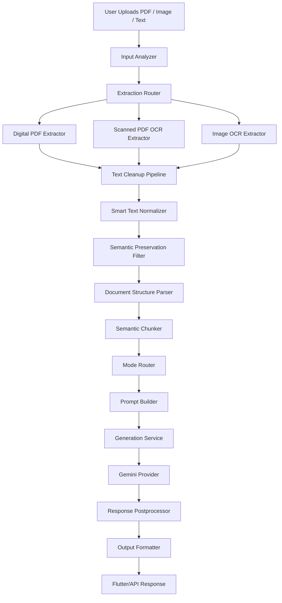

# Lumina AI - Structure-Aware Document Intelligence System

## Abstract

Lumina AI is a FastAPI-based document intelligence system designed to convert digital PDFs, scanned PDFs, images, camera scans, and pasted text into task-specific AI outputs. The system combines extraction, OCR cleanup, smart normalization, semantic preservation, document structure parsing, semantic chunking, prompt construction, Gemini generation, response postprocessing, and structured output formatting for a Flutter frontend.

The project is built as an AI engineering pipeline rather than a single summarization prompt. Its central idea is that reliable document generation depends on preserving source structure before asking a language model to summarize, answer, format, or transform the content. Lumina therefore separates extraction quality, text cleanup, structural reconstruction, routing, generation, and final response formatting into explicit modules.

## Problem Statement

Most OCR and extraction tools flatten documents into plain text. Headings, bullet boundaries, tables, question numbers, labels, contact fields, and visual grouping can be lost during extraction. When this flattened text is sent directly to a generic summarizer, important information may be merged, omitted, duplicated, or reformatted incorrectly.

The input problem is also heterogeneous. A user may upload a digital PDF with selectable text, a scanned PDF that requires OCR, an image of handwritten or printed notes, or pasted text from another source. These inputs require different extraction strategies and different confidence assumptions.

The output problem is equally important. Users do not always need a generic summary. Students may need flashcards, exam notes, question answers, or revision sheets. Professionals may need meeting minutes, action items, structured reports, emails, or tables. General users may need simplification, key points, text cleanup, or concise summaries. Lumina AI treats the selected task as part of the routing and prompt-building problem.

## Motivation

Students often work with photographed notes, PDFs, textbook pages, question papers, and mixed-quality OCR. They need outputs that preserve concepts, questions, definitions, examples, and exam instructions rather than compressed generic summaries.

Professionals often work with meeting notes, reports, resumes, policy documents, tables, action lists, and email drafts. These workflows require traceability, structure, and task-specific formatting. Losing a date, owner, deadline, row, or label can make the generated output unreliable.

Document-heavy workflows benefit from AI only when extraction and generation are treated as a pipeline. Lumina AI exists to explore that pipeline: how to turn messy source material into structured, task-aware, frontend-ready outputs while preserving meaningful source information.

## Key Features

- PDF, image, camera scan, and pasted text input support.
- OCR extraction for scanned PDFs and images.
- Digital PDF versus scanned PDF routing.
- Conservative OCR cleanup before higher-level transformations.
- Smart text normalization for headings, bullets, labels, questions, and dense OCR text.
- Semantic preservation filtering to reduce noise without removing important content.
- Document structure parsing for titles, headings, paragraphs, lists, questions, key-value fields, and table-like text.
- Semantic chunking for long or structured documents.
- Student, professional, and general generation modes.
- Task-based Gemini generation.
- Response postprocessing to remove generic model wrappers and repair markdown.
- Structured output formatting for markdown, plain text, sections, and tables.
- Markdown and plain text output for Flutter rendering, sharing, and export.
- Structured table extraction for frontend rendering.
- Cache-ready architecture with request hashing, Redis exact cache hooks, and semantic cache hooks.
- FastAPI backend with Firebase authentication, usage limits, job status support, and deployment routes.

## System Architecture



## Module Architecture

The current implementation is in `model_systems/`. The production module grouping is shown below. If compatibility wrappers are used during refactoring, they should preserve old imports while forwarding to these grouped responsibilities.


## Methodology / Pipeline Design

### Input Analysis

The pipeline begins by identifying whether the source is pasted text, a digital PDF, a scanned PDF, or an image. This stage estimates document length, file type, OCR requirements, table-like content, page count, and other routing signals.

### Extraction Routing

The extraction router chooses the appropriate extraction strategy. Digital PDFs are handled differently from scanned PDFs. Images are sent to OCR. Text input is passed through with metadata so downstream stages can behave consistently.

### OCR and PDF Extraction

Digital PDF extraction uses PDF text and table extraction where available. Scanned PDFs are rendered page by page and processed through OCR. Image extraction uses OCR engines and preprocessing to improve readability. The system keeps extraction metadata so later stages can reason about confidence and structure.

### Text Cleanup

The cleanup stage removes simple OCR noise, repeated punctuation, repeated page artifacts, malformed spacing, and obvious extraction defects. It is intentionally conservative: it prepares text for normalization without summarizing or deleting meaningful content.

### Smart Text Normalization

Smart normalization repairs dense OCR text by reconstructing likely boundaries such as headings, bullet items, question-style headings, roman numerals, labels, and dense document markers. It protects URLs, emails, numbers, and technical tokens so cleanup does not corrupt meaningful data.

### Semantic Preservation

Semantic preservation applies task-aware rules to reduce obvious noise while protecting important lines. It is designed to avoid the common failure mode where OCR cleanup accidentally removes short but important content such as names, dates, amounts, headings, or action items.

### Document Structure Parsing

The parser converts normalized text into structured signals: title, sections, paragraphs, lists, questions, key-value fields, contact lines, links, and table-like rows. This stage exists because an LLM can infer structure, but asking it to infer everything from flattened text increases hallucination and formatting risk.

### Semantic Chunking

Long or structure-rich documents are split into chunks that preserve source order and meaning. Chunks can represent sections, paragraphs, tables, key-value groups, layout blocks, or plain text segments. This supports hierarchical generation for larger inputs.

### Mode Routing

Mode routing maps the user selected mode and task to a generation target. Student, professional, and general modes use different output expectations, tone, and structure.

### Prompt Building

The prompt builder constructs task-specific prompts using source text, structure summaries, selected chunks, routing metadata, document type, and task policy. It includes special instructions for table formatting, question answering, study notes, action items, reports, emails, and other outputs.

### Gemini Generation

The generation service sends the prompt to Gemini. The current backend uses a Gemini-only path. The provider abstraction is the intended design direction so model-specific code can be isolated while preserving the existing `GenerationService` response contract.

### Response Postprocessing

The postprocessor removes generic model wrappers, duplicate headings, empty sections, broken bullets, repeated lines, and common markdown defects. It does not replace the main formatting layer; it prepares generated text for final schema formatting.

### Output Formatting

The formatter returns a Flutter-compatible response with markdown, plain text, sections, and structured table data. It includes task-specific repairs, especially for `table_format`, where the frontend needs markdown and structured table metadata.

## Repository Structure and File Responsibilities

The active backend repository is:

```text
ai_backend/
  main.py
  requirements.txt
  Dockerfile
  runtime.txt
  README.md
  README_HF_SPACE.md
  celery_worker.py
  test_full_generation_pipeline.py
  model_systems/
  cloudflare-worker/
```

The files below are grouped by the intended production module architecture. The current implementation may keep flat compatibility imports during migration.

### core/

#### core/pipeline_router.py

Purpose: Orchestrates the full document pipeline from input analysis through final formatting.

Why it exists: The system has many explicit stages. A central router keeps the application API simple while allowing extraction, cleanup, parsing, chunking, generation, and formatting to evolve independently.

Pipeline role: Coordinates input analysis, extraction, cleanup, normalization, preservation, structure parsing, chunking, mode routing, prompt building, generation, postprocessing, and output formatting.

#### core/mode_router.py

Purpose: Converts the selected mode and task into a generation target.

Why it exists: Student, professional, and general workflows require different tone, detail, structure, and output shapes.

Pipeline role: Runs after chunking and before prompt construction.

#### core/route_selector.py

Purpose: Selects route metadata such as light, standard, or heavy processing paths based on extracted features and complexity.

Why it exists: Not all documents need the same processing budget. Routing helps protect latency, cost, and deployment memory.

Pipeline role: Connects input features and complexity scoring to downstream processing decisions.

#### core/schema_validator.py

Purpose: Ensures API responses contain required frontend-compatible fields.

Why it exists: The Flutter app expects stable keys even when generation fails, cache hits occur, or route metadata is incomplete.

Pipeline role: Validates final response payloads before returning them through FastAPI.

#### core/safety_controls.py

Purpose: Applies endpoint limits, heavy-route limits, PDF page checks, violation tracking, and timeout wrappers.

Why it exists: Document processing can be expensive and must be bounded for public deployment.

Pipeline role: Guards endpoints and heavy processing paths before and during generation.

#### core/routing_logger.py

Purpose: Logs routing decisions and processing metadata.

Why it exists: Routing quality, cache behavior, and user feedback need observability without storing raw document content.

Pipeline role: Records request metadata after generation or cache lookup.

#### core/job_status.py

Purpose: Stores asynchronous job status, result payloads, and errors.

Why it exists: Large documents may need background processing rather than a single blocking request.

Pipeline role: Supports `/v2/jobs/generate` and `/v2/jobs/{job_id}`.

#### core/task_queue.py

Purpose: Provides queue mode selection and background task dispatch hooks.

Why it exists: The project supports in-process operation now and can be extended to Celery/Redis-backed workers.

Pipeline role: Bridges API requests to synchronous or background processing.

### input/

#### input/input_analyzer.py

Purpose: Analyzes raw text or files and returns structured input metadata.

Why it exists: Extraction and routing depend on input type, page count, selectable text, file size, and table-like signals.

Pipeline role: Runs near the beginning of text and file workflows.

#### input/input_understanding.py

Purpose: Infers document type and high-level intent signals from text or files.

Why it exists: Different documents benefit from different prompt policies and structure assumptions.

Pipeline role: Supplies document understanding metadata to the pipeline.

#### input/feature_extractor.py

Purpose: Converts input analysis into route-friendly numeric and categorical features.

Why it exists: Route selection should use explicit features rather than scattered heuristics.

Pipeline role: Feeds the complexity scorer and route selector.

#### input/complexity_scorer.py

Purpose: Scores document complexity based on extracted features.

Why it exists: Long, table-heavy, OCR-heavy, or structure-rich documents need different handling from short pasted text.

Pipeline role: Helps choose light, standard, or heavy paths.

### extraction/

#### extraction/extraction_router.py

Purpose: Routes text, PDF, scanned PDF, and image inputs to the correct extractor.

Why it exists: A single extraction function would become brittle because digital PDFs, scanned PDFs, and images require different strategies.

Pipeline role: Entry point for backend-side extraction.

#### extraction/digital_pdf_extractor.py

Purpose: Extracts selectable text and tables from digital PDFs.

Why it exists: Digital PDFs can preserve text and table structure better than OCR, so OCR should not be the first option.

Pipeline role: Handles PDF files with selectable text.

#### extraction/scanned_pdf_extractor.py

Purpose: Renders scanned PDF pages and sends page images to image OCR.

Why it exists: Scanned PDFs do not contain reliable selectable text.

Pipeline role: Handles image-based PDFs.

#### extraction/image_ocr_extractor.py

Purpose: Extracts text, blocks, confidence, and OCR metadata from image files.

Why it exists: Image OCR requires preprocessing, engine fallback, and confidence handling.

Pipeline role: Handles uploaded images and pages rendered from scanned PDFs.

#### extraction/complex_document_extractor.py

Purpose: Provides optional extraction hooks for richer document parsing such as Docling.

Why it exists: Layout-aware extraction is planned for more complex documents, but it must remain optional for lightweight deployments.

Pipeline role: Future-facing extractor for complex files when dependencies and memory allow it.

#### extraction/ocr_pipeline.py

Purpose: Normalizes extraction behavior across text, PDFs, scanned PDFs, images, OCR quality reports, and fallback logic.

Why it exists: The rest of the pipeline needs consistent extracted text and metadata regardless of source type.

Pipeline role: Main extraction interface used by the pipeline router.

#### extraction/ocr_correction_model.py

Purpose: Applies conservative OCR correction rules.

Why it exists: OCR correction can damage source facts if it is too aggressive. This module keeps correction bounded.

Pipeline role: Supports cleanup and OCR improvement without rewriting meaning.

### preprocessing/

#### preprocessing/text_cleanup_pipeline.py

Purpose: Cleans OCR text by normalizing spacing, bullets, punctuation, repeated artifacts, and page noise.

Why it exists: OCR output often contains mechanical noise that hurts structure parsing and prompt quality.

Pipeline role: Runs before smart normalization.

#### preprocessing/smart_text_normalizer.py

Purpose: Reconstructs high-confidence document boundaries such as headings, bullet items, question-style headings, roman list markers, and labels while preserving URLs, emails, numbers, and technical tokens.

Why it exists: OCR often flattens visual layout into one paragraph, so this module restores useful structure before parsing.

Pipeline role: Runs after cleanup and before semantic preservation.

#### preprocessing/semantic_preservation_filter.py

Purpose: Removes obvious noise while protecting important content according to mode and task.

Why it exists: Cleanup systems can accidentally remove meaningful short lines. This module preserves source value before parsing and generation.

Pipeline role: Runs before final structure parsing.

### structure/

#### structure/document_structure_parser.py

Purpose: Detects titles, sections, questions, bullets, numbered items, roman numerals, key-value fields, links, contact lines, paragraphs, and text-derived tables.

Why it exists: Explicit structure reduces the amount of layout inference expected from the language model.

Pipeline role: Produces structured document signals for chunking and prompt building.

### retrieval/

#### retrieval/semantic_chunker.py

Purpose: Splits structured documents into source-order chunks and assigns chunk metadata.

Why it exists: Long documents cannot always be safely handled as one prompt, and structure-aware chunks improve hierarchical generation.

Pipeline role: Runs after structure parsing.

#### retrieval/semantic_cache.py

Purpose: Provides a semantic cache interface for similar request reuse.

Why it exists: Reusing previous results can reduce latency and cost when the same or similar content is processed.

Pipeline role: Supports cache-ready architecture. Persistent vector search is planned, not fully implemented.

#### retrieval/request_hashing.py

Purpose: Normalizes request text and creates stable cache keys.

Why it exists: Exact cache hits require deterministic hashing that ignores harmless whitespace and common OCR noise.

Pipeline role: Used by API endpoints before generation.

#### retrieval/redis_cache.py

Purpose: Stores and retrieves exact cached responses in Redis when configured.

Why it exists: Redis allows deployment-friendly exact cache behavior without changing the generation pipeline.

Pipeline role: Used by API endpoints for cache lookup and persistence.

### generation/

#### generation/prompt_builder.py

Purpose: Builds compact and expanded prompts using task, mode, source text, structure, chunks, and route metadata.

Why it exists: Good outputs require task-specific instructions. A generic summarization prompt is not enough for Q&A, flashcards, tables, emails, or reports.

Pipeline role: Runs after mode routing and before generation.

#### generation/generation_service.py

Purpose: Provides the generation interface used by the pipeline.

Why it exists: The pipeline should call one generation service even if provider internals change.

Pipeline role: Sends prompts to Gemini in the current implementation and returns normalized generation metadata.

#### generation/response_postprocessor.py

Purpose: Cleans generated markdown by removing wrappers, generic closings, duplicate headings, broken bullets, and repeated lines.

Why it exists: LLM output can include conversational wrappers or minor markdown defects.

Pipeline role: Runs after generation and before final formatting.

#### generation/output_formatter.py

Purpose: Converts generated text into a stable frontend schema with markdown, plain text, sections, and table data.

Why it exists: The Flutter app needs predictable fields for rendering, saving, sharing, exporting, and table display.

Pipeline role: Final pipeline stage before API response assembly.

### providers/

#### providers/base_provider.py

Purpose: Defines the intended interface for model providers.

Why it exists: Provider-specific behavior should be isolated from pipeline orchestration.

Pipeline role: Planned abstraction for normalized provider responses.

#### providers/gemini_provider.py

Purpose: Intended Gemini implementation for the provider layer.

Why it exists: Gemini-specific model validation, request payloads, API errors, and fallback behavior should live outside the generic generation service.

Pipeline role: Planned active provider behind `GenerationService`.

#### providers/provider_router.py

Purpose: Intended provider selector based on environment configuration.

Why it exists: The system should support a clean default provider today and future providers later without mixing APIs.

Pipeline role: Planned bridge between `GenerationService` and concrete provider implementations.

### legacy/

No legacy module is required conceptually. If files cannot be moved safely during refactoring, they should be placed here only when they are retained for compatibility and not part of the active pipeline.

## Modes and Tasks

### Student Mode

- `important_notes`: Produces study-focused notes from source content.
- `answer_questions`: Answers explicit questions in the source or user input.
- `qa_generation`: Builds question-and-answer study material.
- `flashcards`: Produces flashcard-style revision items.
- `mcqs`: Generates multiple-choice questions.
- `beginner_explanation`: Explains source material in simpler language.
- `revision_sheet`: Builds a concise revision-ready sheet.

### Professional Mode

- `executive_summary`: Summarizes documents for decision makers.
- `main_points`: Extracts major points and business-relevant details.
- `action_items`: Extracts owners, tasks, deadlines, and follow-ups when present.
- `meeting_minutes`: Converts notes into meeting minutes.
- `structured_report`: Produces a report-style output.
- `table_format`: Produces structured table output.
- `email_draft`: Builds an email draft from source material.

### General Mode

- `short_summary`: Produces a concise summary.
- `bullet_summary`: Produces a bullet-based summary.
- `key_points`: Extracts key ideas.
- `simplify`: Rewrites content in simpler language.
- `clean_text`: Cleans and formats text without changing meaning.

## Output Schema

The frontend-compatible document response is expected to preserve these fields:

```text
title
markdown
plain_text
plainText
sections
section_count
sectionCount
tables
table_count
tableCount
mode
task
format
model
provider
route
modelTier
cached
metadata
```

`markdown` is used for rich document display and export. `plain_text` and `plainText` support compatibility with Python and Flutter naming conventions. `sections` and `sectionCount` support document navigation. `tables`, `table_count`, and `tableCount` allow table-aware frontend rendering instead of forcing the app to parse markdown manually. `metadata` carries route, model tier, cache, and formatting diagnostics.

## Technical Design Decisions

### Why Gemini 2.5 Flash

Gemini 2.5 Flash is used because the project needs a balance of instruction following, document transformation quality, latency, and cost. It is suitable for structured summarization, Q&A, table formatting, and mixed student/professional tasks. A lighter fallback model can be configured for lower-cost or quota-sensitive paths.

### Why Provider Abstraction Exists

Provider abstraction separates model-specific API details from the pipeline. The pipeline should not care whether generation is performed by Gemini or another future provider. It should receive a normalized result containing success state, provider, model, generated text, error type, and fallback metadata.

### Why OCR Cleanup Is Separate From Smart Normalization

OCR cleanup removes mechanical extraction defects. Smart normalization reconstructs semantic and visual boundaries. Keeping them separate makes the pipeline easier to debug and prevents low-level cleaning rules from becoming responsible for higher-level document interpretation.

### Why Structure Parsing Exists Even Though LLMs Can Infer Structure

LLMs can infer structure, but asking the model to infer structure from flattened OCR text increases risk. Explicit parsing provides titles, headings, lists, questions, fields, and table candidates before generation. This improves prompt grounding and gives the formatter usable metadata.

### Why the Formatter Returns Markdown, Plain Text, and Structured Tables

Markdown is useful for readable output, export, and rich display. Plain text is useful for search, sharing, and fallback rendering. Structured tables allow the frontend to render tables natively instead of relying only on markdown parsing.

### Why RAG Is Planned but Not Forced Yet

Retrieval-augmented generation is useful only when extraction quality and chunk quality are strong. Lumina currently prioritizes accurate extraction, normalization, parsing, and chunking before making persistent RAG a required part of every request.

## Current Bottlenecks

- OCR quality depends heavily on the source image or scan quality.
- Layout preservation is not yet as strong as a full Docling, LayoutLM, or Paddle layout-model workflow.
- Complex multi-column PDFs can still be difficult.
- Gemini quota and rate limits can affect generation availability.
- OCR correction is conservative to avoid corrupting facts.
- Persistent vector database and RAG workflows are planned, not fully implemented.
- GraphRAG is future work and is not currently implemented.
- Table reconstruction depends on extraction quality and can be unreliable for visually complex tables.

## Future Work

- Deeper Docling integration for layout-aware extraction.
- Layout-aware OCR blocks with coordinates and reading-order recovery.
- Persistent user knowledge base.
- Temporary request-level RAG for long documents.
- Persistent RAG for saved user documents.
- Hybrid search across exact, semantic, and metadata filters.
- Reranking for chunk selection.
- Query rewriting and HyDE-style retrieval preparation.
- Context compression for long document synthesis.
- GraphRAG for multi-document knowledge relationships.
- Evaluation loop with expected outputs for each mode and task.
- Native table rendering improvements in Flutter.
- Confidence-based OCR correction.
- Stronger multi-column and table reconstruction.
- CI checks for compile, app import, worker syntax, and response schema stability.

## API Surface

Important routes:

```text
GET  /
GET  /health
GET  /app-version
GET  /download-apk
GET  /download-app
GET  /update
GET  /about
GET  /contact
GET  /privacy-policy
GET  /terms-and-conditions
GET  /privacy
GET  /terms
GET  /robots.txt
GET  /sitemap.xml
POST /v2/generate
POST /v2/jobs/generate
GET  /v2/jobs/{job_id}
POST /v2/feedback
POST /v2/generate-file
POST /summarize
```

`/privacy-policy` and `/terms-and-conditions` are the canonical legal routes.
`/privacy` and `/terms` redirect to those canonical pages to avoid duplicate
indexed legal content. `/robots.txt` allows public pages while excluding private
API/document-processing routes, and `/sitemap.xml` lists only canonical public
URLs.

`/v2/generate` is the main authenticated text-generation route. `/v2/generate-file` supports backend-side file extraction. `/summarize` is retained for legacy compatibility.

## Frontend Integration

The Flutter app consumes the API response through `ApiService` and stores generated documents through Firebase services. The response schema must remain stable for:

- Workspace rendering.
- History and folders.
- Search and favorites.
- Summary detail view.
- Markdown/plain text export.
- Table display and future native table rendering.
- Feedback metadata.

## Deployment Notes

### Local Setup

From `ai_backend`:

```powershell
python -m venv .venv
.venv\Scripts\activate
pip install -r requirements.txt
uvicorn main:app --reload
```

### Testing

```powershell
python -m compileall model_systems
python test_full_generation_pipeline.py
python -c "from main import app; print('FastAPI app import OK')"
```

### Environment

Provider-layer target configuration:

```text
GEMINI_API_KEY=
GEMINI_PRIMARY_MODEL=gemini-2.5-flash
GEMINI_FALLBACK_MODEL=gemini-2.5-flash-lite
GENERATION_PROVIDER=gemini
REDIS_URL=
LUMINA_QUEUE_BACKEND=in_process
```

Current compatibility variables may still be used by the existing generation service:

```text
LUMINA_API_KEY=
LUMINA_MODEL_NAME=gemini-2.5-flash
LUMINA_API_URL=
LUMINA_GENERATION_PROVIDER=gemini
```

### GitHub / Hugging Face Deployment

The backend is prepared for Hugging Face Spaces using Docker. The Dockerfile installs system OCR dependencies, Python requirements, copies the backend, exposes port `7860`, and starts Uvicorn.

The repository also contains a Cloudflare Worker under `cloudflare-worker/` that can proxy public domain traffic to the Hugging Face Space. This deployment shape is suitable for a portfolio and interview project. It should not be described as unsupported large-scale production infrastructure until persistent storage, queue hardening, monitoring, CI, and model evaluation are strengthened.

## Requirements

The backend uses FastAPI, Uvicorn, Firebase Admin, Redis/Celery hooks, PDF/OCR libraries, and optional document/OCR tooling:

```text
fastapi
uvicorn
python-multipart
python-dotenv
slowapi
firebase-admin
pymupdf
pdfplumber
pillow
pytesseract
opencv-python-headless
rapidocr-onnxruntime
redis
celery
sentence-transformers
docling
```

Some dependencies are optional or deployment-sensitive. Heavy layout or OCR models should be enabled only on hardware that can support them.

## Research and Engineering Positioning

Lumina AI is best understood as a structure-aware document intelligence system. It tests the hypothesis that document generation quality improves when extraction, cleanup, normalization, structure parsing, chunking, routing, prompt design, generation, and formatting are treated as separate engineering problems.

The project does not claim that OCR, table recovery, RAG, or GraphRAG are solved completely. Instead, it provides a practical foundation where each stage can be evaluated, replaced, and improved without rewriting the whole backend.
